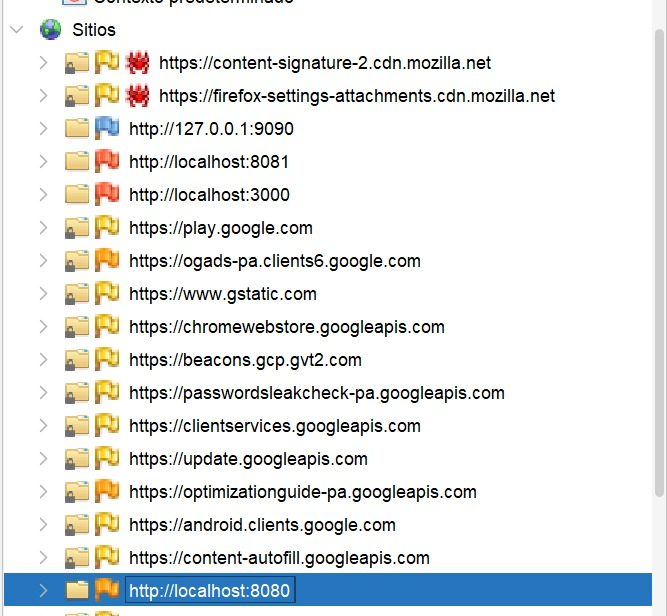
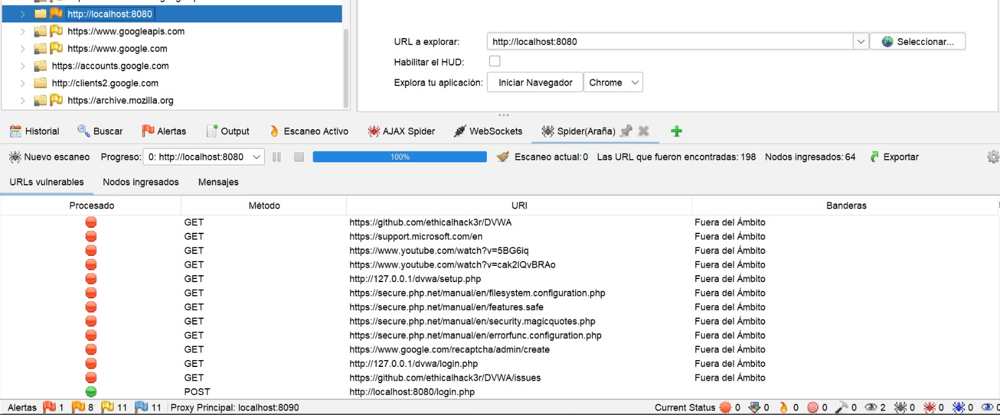
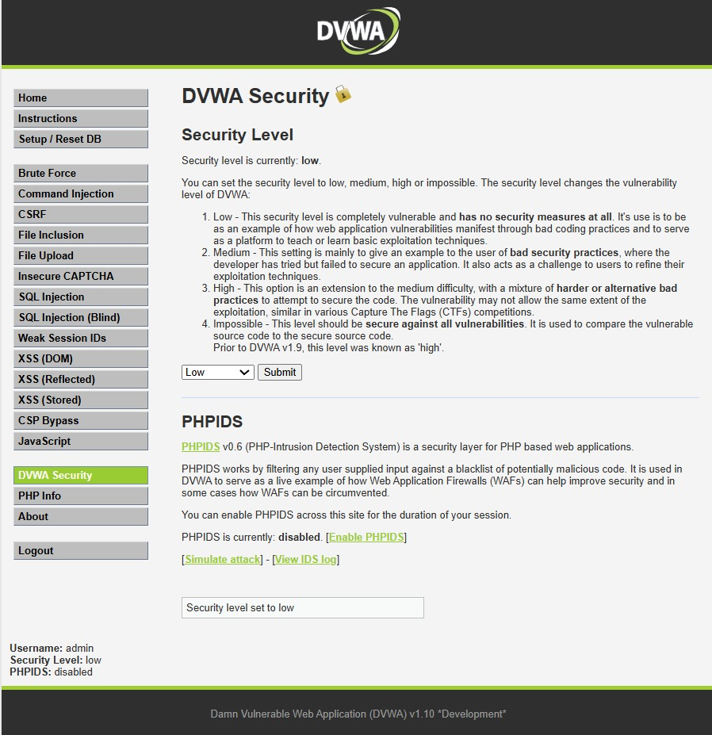
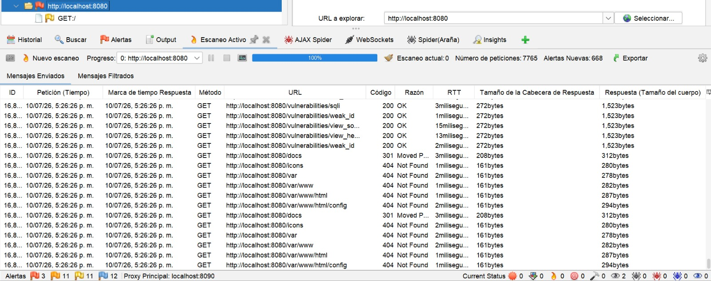
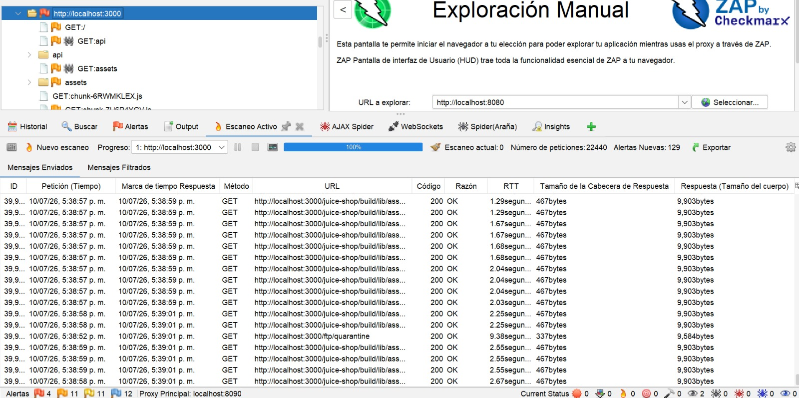
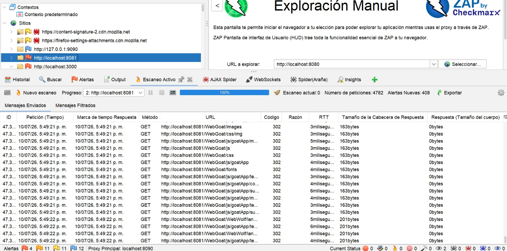
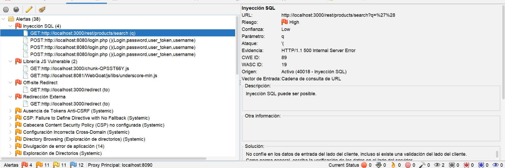
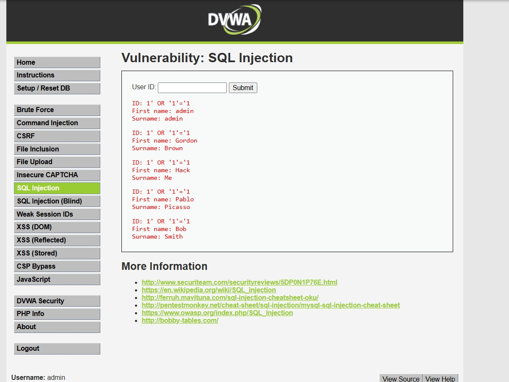

# Guía del Laboratorio

# Detección de Ataques Web OWASP mediante OWASP ZAP (OWASP Top 10)

---

# Paso 1. Crear el repositorio en GitHub

## 1.1 Iniciar sesión en GitHub

1. Acceder a https://github.com
2. Iniciar sesión con una cuenta de GitHub.

## 1.2 Crear un nuevo repositorio

1. Hacer clic en **New Repository**.
2. Asignar el nombre:

```text
OWASP-ZAP-LAB
```

3. Seleccionar la opción **Public**.
4. Marcar las opciones:

* Add a README file
* Add .gitignore
* Add License (MIT)

5. Hacer clic en **Create Repository**.

### Evidencia


---

# Paso 2. Crear la estructura del proyecto

## 2.1 Crear las carpetas principales

Para que cualquier integrante del equipo pueda recrear el laboratorio, se recomienda crear la misma estructura de carpetas utilizada durante el desarrollo de la práctica.

### Opción 1. Crear las carpetas desde GitHub

1. Ingresar al repositorio creado.
2. Hacer clic en **Add file → Create new file**.
3. Escribir la ruta completa del archivo para que GitHub cree automáticamente las carpetas.

Ejemplos:

* guia-laboratorio/README.md
* configuracion/dvwa/README.md
* configuracion/juiceshop/README.md
* configuracion/webgoat/README.md
* evidencias/capturas/README.md
* resultados/README.md
* logs/README.md

4. Agregar un contenido básico al archivo.
5. Hacer clic en **Commit changes**.

### Estructura utilizada

```text
OWASP-ZAP-LAB
│
├── guia-laboratorio
│   └── README.md
│
├── configuracion
│   ├── dvwa
│   │   └── README.md
│   ├── juiceshop
│   │   └── README.md
│   └── webgoat
│       └── README.md
│
├── evidencias
│   └── capturas
│       └── README.md
│
├── resultados
│   └── README.md
│
├── logs
│   └── README.md
│
├── README.md
├── LICENSE
└── .gitignore
```

### Evidencia


---

# Paso 3. Verificar requisitos de virtualización

## 3.1 Abrir el Administrador de tareas

1. Presionar:

```text
Ctrl + Shift + Esc
```

2. Ir a la pestaña:

```text
Rendimiento
```

3. Seleccionar:

```text
CPU
```

4. Verificar que aparezca:

```text
Virtualización: Habilitado
```

### Evidencia


---

# Paso 4. Instalar Docker Desktop

## 4.1 Descargar Docker Desktop

1. Acceder a:

https://www.docker.com/products/docker-desktop/

2. Descargar la versión:

```text
Windows AMD64
```

---

## 4.2 Ejecutar el instalador

1. Ejecutar el archivo descargado.
2. Seleccionar:

```text
All-users installation
```

3. Continuar con la instalación.

### Evidencia


---

## 4.3 Reiniciar el sistema

1. Finalizar la instalación.
2. Reiniciar Windows cuando sea solicitado.

### Evidencia


---

## 4.4 Instalar WSL2

Docker Desktop requiere WSL2 para ejecutar contenedores Linux.

### Abrir CMD como Administrador

Presionar:

```text
Inicio → CMD → Ejecutar como administrador
```

### Instalar WSL

Ejecutar:

```bash
wsl --install
```

Este comando:

* Instala Windows Subsystem for Linux.
* Descarga Ubuntu.
* Configura WSL2.
* Prepara el sistema para Docker Desktop.

### Evidencia


---

### Reiniciar el equipo

Una vez finalizada la instalación reiniciar Windows.

### Verificar la instalación de WSL

Ejecutar:

```bash
wsl --version
```

Resultado esperado:

```text
WSL version: X.X.X
Kernel version: X.X.X
```

### Evidencia


---

## 4.5 Configurar Ubuntu

Después del reinicio Ubuntu iniciará automáticamente.

### Crear usuario Linux

Ejemplo:

```text
Usuario: david
```

### Crear contraseña

Ingresar una contraseña y confirmarla.

### Finalizar configuración

Esperar hasta visualizar el prompt del sistema Ubuntu.

---

## 4.6 Verificar Docker Desktop

Abrir CMD.

### Verificar versión de Docker

Ejecutar:

```bash
docker --version
```

Resultado esperado:

```text
Docker version 29.5.3
```

### Verificar que Docker esté funcionando

Ejecutar:

```bash
docker ps
```

Resultado esperado:

```text
CONTAINER ID   IMAGE   COMMAND   CREATED   STATUS   PORTS   NAMES
```

Si aparece la tabla anterior significa que Docker Engine está funcionando correctamente.

### Evidencia


---

# Paso 5. Implementar DVWA

## 5.1 Descargar la imagen Docker

Abrir CMD y ejecutar:

```bash
docker pull vulnerables/web-dvwa
```

### Evidencia


---

## 5.2 Crear el contenedor

Ejecutar:

```bash
docker run -d --name dvwa -p 8080:80 vulnerables/web-dvwa
```

### Evidencia


---

## 5.3 Verificar el contenedor

Ejecutar:

```bash
docker ps
```

Debe aparecer:

```text
dvwa
```

### Evidencia


---

## 5.4 Verificar funcionamiento

Abrir el navegador:

```text
http://localhost:8080
```

### Evidencia


---

# Paso 6. Implementar OWASP Juice Shop

## 6.1 Descargar la imagen Docker

Ejecutar:

```bash
docker pull bkimminich/juice-shop
```

### Evidencia


---

## 6.2 Crear el contenedor

Ejecutar:

```bash
docker run -d --name juice-shop -p 3000:3000 bkimminich/juice-shop
```

### Evidencia


---

## 6.3 Verificar el contenedor

Ejecutar:

```bash
docker ps
```

Debe aparecer:

```text
juice-shop
```

### Evidencia


---

## 6.4 Verificar funcionamiento

Abrir:

```text
http://localhost:3000
```

### Evidencia


---

# Paso 7. Implementar WebGoat

## 7.1 Descargar la imagen Docker

Ejecutar:

```bash
docker pull webgoat/webgoat
```

### Evidencia


---

## 7.2 Crear el contenedor

Ejecutar:

```bash
docker run -d --name webgoat -p 8081:8080 webgoat/webgoat
```

### Evidencia


---

## 7.3 Verificar el contenedor

Ejecutar:

```bash
docker ps
```

Debe aparecer:

```text
webgoat
```

### Evidencia


---

## 7.4 Verificar funcionamiento

Abrir:

```text
http://localhost:8081/WebGoat
```

### Evidencia


---

# Paso 8. Instalar OWASP ZAP

## 8.1 Ejecutar el instalador

1. Descargar OWASP ZAP desde el sitio oficial.
2. Ejecutar el instalador en Windows.

### Evidencia


---

## 8.2 Instalar OWASP ZAP

1. Aceptar los términos de licencia.
2. Continuar con la instalación utilizando la configuración predeterminada.
3. Esperar a que finalice el proceso.

### Evidencia


---

## 8.3 Finalizar la instalación

1. Una vez concluida la instalación seleccionar **Finish**.
2. Esperar a que la aplicación se inicie automáticamente.

### Evidencia


---

## 8.4 Abrir OWASP ZAP

1. Iniciar OWASP ZAP.
2. Aceptar la configuración predeterminada de la sesión.
3. Verificar que aparezca la interfaz principal de la herramienta.

### Evidencia


---

# Paso 9. Configuración previa de OWASP ZAP

Antes de iniciar el reconocimiento de las aplicaciones vulnerables es necesario configurar correctamente OWASP ZAP para evitar conflictos con los puertos utilizados por los laboratorios.

---

## 9.1 Configurar el Proxy Local de OWASP ZAP

Por defecto OWASP ZAP utiliza el puerto `8080` para su proxy local. Sin embargo, DVWA también utiliza este puerto, generando conflictos durante la navegación y el reconocimiento automático.

Para evitar este problema se recomienda modificar el puerto del proxy de OWASP ZAP.

1. Abrir OWASP ZAP.
2. Ir al menú:

```text
Herramientas → Opciones → Servidores/Proxies Locales
```

3. Ubicar la configuración:

```text
Proxy Principal
```

4. Cambiar el puerto:

```text
8080 → 8090
```

5. Guardar la configuración.

---

## 9.2 Iniciar el navegador controlado por OWASP ZAP

Para garantizar que todo el tráfico sea interceptado correctamente, se utilizará el navegador lanzado directamente desde OWASP ZAP.

1. Ir a la pestaña:

```text
Exploración Manual
```

2. En el campo URL ingresar:

```text
http://localhost:8080
```

3. Seleccionar el navegador:

```text
Chrome
```

4. Hacer clic en:

```text
Iniciar Navegador
```

El navegador será iniciado automáticamente utilizando el proxy configurado por OWASP ZAP.

---

# Paso 10. Registro de aplicaciones en OWASP ZAP

Durante esta fase se registrarán las aplicaciones vulnerables dentro del árbol de sitios de OWASP ZAP.

---

## 10.1 Registrar DVWA

1. Acceder desde el navegador iniciado por ZAP a:

```text
http://localhost:8080
```

2. Iniciar sesión utilizando las credenciales predeterminadas:

```text
Usuario: admin
Contraseña: password
```

---

## 10.2 Navegar manualmente por DVWA

Con el objetivo de registrar rutas y recursos adicionales dentro de OWASP ZAP se recorrieron manualmente los principales módulos vulnerables de la aplicación.

Se accedió a:

- Brute Force
- Command Injection
- SQL Injection
- SQL Injection Blind
- XSS Reflected
- XSS Stored
- File Upload
- CSRF
- Weak Session IDs

---

## 10.3 Registrar OWASP Juice Shop

Acceder a:

```text
http://localhost:3000
```

Recorrer las principales funcionalidades:

- Catálogo de productos
- Buscador
- Login
- Carrito de compras
- Menú lateral

---

## 10.4 Registrar WebGoat

Acceder a:

```text
http://localhost:8081/WebGoat
```

Explorar algunas lecciones iniciales:

- SQL Injection
- Cross Site Scripting
- Access Control

---

## 10.5 Verificar el árbol de sitios

Al finalizar la navegación las aplicaciones deberán aparecer registradas en el panel:

```text
Sites
```

Se espera visualizar:

```text
http://localhost:8080
http://localhost:3000
http://localhost:8081
```

### Evidencia



---

# Paso 11. Descubrimiento de recursos mediante Spider

La herramienta Spider permite descubrir automáticamente páginas, rutas, formularios y recursos presentes dentro de cada aplicación.

---

## 11.1 Ejecutar Spider sobre DVWA

1. Seleccionar:

```text
http://localhost:8080
```

2. Hacer clic derecho:

```text
Attack → Spider
```

3. Iniciar el análisis.

### Evidencia



---

## 11.2 Ejecutar Spider sobre OWASP Juice Shop

1. Seleccionar:

```text
http://localhost:3000
```

2. Ejecutar:

```text
Attack → Spider
```

### Evidencia


---

## 11.3 Ejecutar Spider sobre WebGoat

1. Seleccionar:

```text
http://localhost:8081
```

2. Ejecutar:

```text
Attack → Spider
```

### Evidencia


---

# Paso 12. Descubrimiento de contenido dinámico mediante AJAX Spider

Las aplicaciones modernas utilizan JavaScript para generar contenido dinámico. OWASP ZAP utiliza AJAX Spider para identificar este tipo de recursos.

---

## 12.1 Ejecutar AJAX Spider sobre DVWA

1. Seleccionar:

```text
http://localhost:8080
```

2. Ejecutar:

```text
Attack → AJAX Spider
```

### Evidencia


---

## 12.2 Ejecutar AJAX Spider sobre OWASP Juice Shop

1. Seleccionar:

```text
http://localhost:3000
```

2. Ejecutar:

```text
Attack → AJAX Spider
```

### Evidencia


---

## 12.3 Ejecutar AJAX Spider sobre WebGoat

1. Seleccionar:

```text
http://localhost:8081
```

2. Ejecutar:

```text
Attack → AJAX Spider
```

### Evidencia


---

# Paso 13. Verificación del árbol de recursos descubiertos

Una vez finalizados los procesos de reconocimiento se verificó que OWASP ZAP hubiera identificado correctamente las rutas internas de cada aplicación.

Entre los recursos descubiertos se encontraron:

### DVWA

- /login.php
- /vulnerabilities/
- /security.php
- /setup.php

### Juice Shop

- /rest/products
- /api
- /assets

### WebGoat

- /WebGoat
- /lesson
- /start.mvc

---

# Paso 14. Revisar las alertas pasivas

Durante el reconocimiento OWASP ZAP ejecuta automáticamente un análisis pasivo de las respuestas del servidor sin modificar el comportamiento de las aplicaciones.

Entre las alertas identificadas se encontraron:

- Missing Security Headers
- Missing Anti-CSRF Token
- Cookie sin atributo HttpOnly
- Cookie sin atributo Secure
- Information Disclosure

### Evidencia


---

## Paso 15. Preparar DVWA para el Active Scan

Para maximizar la detección de vulnerabilidades se configuró DVWA con el nivel de seguridad más bajo disponible.

### Iniciar sesión en DVWA

URL utilizada:

```text
http://localhost:8080
```

Credenciales:

```text
Usuario: admin
Contraseña: password
```

### Configurar el nivel de seguridad

Ruta:

```text
DVWA Security → Low → Submit
```

Esta configuración permite que las vulnerabilidades permanezcan completamente expuestas para ser detectadas por OWASP ZAP.



---

## Paso 16. Ejecutar el Active Scan sobre DVWA

En el panel `Sites` se seleccionó:

```text
http://localhost:8080
```

Posteriormente:

```text
Click derecho
→ Attack
→ Active Scan
→ Start Scan
```

Se utilizó la configuración predeterminada:

- Context: Default Context
- Policy: Default Policy

Durante esta fase OWASP ZAP comenzó a enviar automáticamente payloads correspondientes a distintas categorías de ataque como:

- SQL Injection
- Cross Site Scripting
- Command Injection
- Path Traversal



---

## Paso 17. Ejecutar el Active Scan sobre Juice Shop y WebGoat

Se repitió el mismo procedimiento para las aplicaciones restantes.

### Juice Shop

```text
http://localhost:3000
```

```text
Attack
→ Active Scan
→ Start Scan
```

### WebGoat

```text
http://localhost:8081/WebGoat
```

```text
Attack
→ Active Scan
→ Start Scan
```





---

## Paso 18. Monitorear el progreso del escaneo

Durante el Active Scan se supervisó:

- Porcentaje de progreso.
- Número de peticiones enviadas.
- Cantidad de alertas generadas.
- Estado actual del análisis.

OWASP ZAP permitió pausar o detener el escaneo en cualquier momento si fuese necesario.

---

## Paso 19. Revisar las Alertas Activas

Finalizado el Active Scan se revisaron las alertas activas generadas automáticamente por OWASP ZAP.

A diferencia de las alertas pasivas, estas sí corresponden a intentos reales de explotación realizados por la herramienta.

Entre los hallazgos detectados se encontraron:

- SQL Injection
- Cross Site Scripting
- Command Injection
- Off-site Redirect
- Vulnerable JavaScript Library
- Missing Anti-CSRF Token

Para cada alerta se revisó:

- URL afectada.
- Parámetro vulnerable.
- Payload utilizado.
- Evidencia encontrada.
- Recomendaciones proporcionadas por OWASP ZAP.



---

## Paso 20. Clasificar las vulnerabilidades según OWASP Top 10

| Alerta ZAP | Categoría OWASP Top 10 |
|-----------|------------------------|
| SQL Injection | A03:2021 – Injection |
| Cross Site Scripting | A03:2021 – Injection |
| Command Injection | A03:2021 – Injection |
| Missing Anti-CSRF Token | A01:2021 – Broken Access Control |
| Cookie sin Secure/HttpOnly | A05:2021 – Security Misconfiguration |
| Missing Security Headers | A05:2021 – Security Misconfiguration |
| Path Traversal | A01:2021 – Broken Access Control |
| Weak Session IDs | A07:2021 – Identification and Authentication Failures |

Esta clasificación servirá como base para el informe final elaborado por la Persona 4.

---

## Paso 21. Validación Manual de Hallazgos Críticos

Para incrementar la confiabilidad del informe se realizó una validación manual de la vulnerabilidad de SQL Injection detectada automáticamente por OWASP ZAP.

### URL utilizada

```text
http://localhost:8080/vulnerabilities/sqli/
```

### Payload utilizado

```sql
1' OR '1'='1
```

La aplicación respondió mostrando múltiples registros de usuarios, demostrando que la consulta SQL podía ser manipulada mediante entradas no validadas.

Esto permitió confirmar manualmente la existencia de la vulnerabilidad.



---

## Paso 22. Exportar el Reporte Técnico

Finalmente se generó el reporte oficial del análisis realizado por OWASP ZAP.

Ruta utilizada:

```text
Informe
→Generar informe
```

Formatos utilizados:

- HTML
- PDF
