# Guía del Laboratorio

# Detección de Ataques Web OWASP mediante OWASP ZAP (OWASP Top 10)

---

# Paso 1. Crear el repositorio en GitHub

## 1.1 Iniciar sesión en GitHub

1. Acceder a https://github.com
2. Iniciar sesión con una cuenta de GitHub.

## 1.2 Crear un nuevo repositorio

1. Hacer clic en **New Repository**.
2. Asignar el nombre:

```text
OWASP-ZAP-LAB
```

3. Seleccionar la opción **Public**.
4. Marcar las opciones:

* Add a README file
* Add .gitignore
* Add License (MIT)

5. Hacer clic en **Create Repository**.

### Evidencia

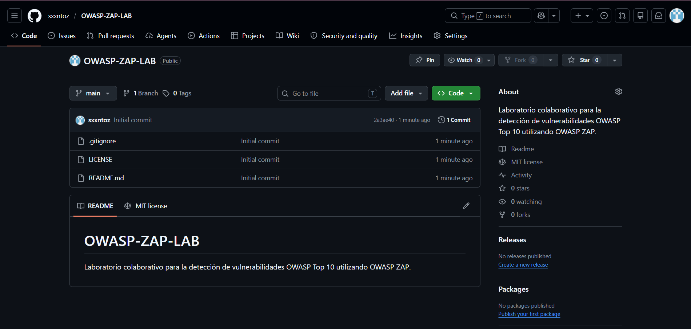

---

# Paso 2. Crear la estructura del proyecto

## 2.1 Crear las carpetas principales

Para que cualquier integrante del equipo pueda recrear el laboratorio, se recomienda crear la misma estructura de carpetas utilizada durante el desarrollo de la práctica.

### Opción 1. Crear las carpetas desde GitHub

1. Ingresar al repositorio creado.
2. Hacer clic en **Add file → Create new file**.
3. Escribir la ruta completa del archivo para que GitHub cree automáticamente las carpetas.

Ejemplos:

* guia-laboratorio/README.md
* configuracion/dvwa/README.md
* configuracion/juiceshop/README.md
* configuracion/webgoat/README.md
* evidencias/capturas/README.md
* resultados/README.md
* logs/README.md

4. Agregar un contenido básico al archivo.
5. Hacer clic en **Commit changes**.

### Estructura utilizada

```text
OWASP-ZAP-LAB
│
├── guia-laboratorio
│   └── README.md
│
├── configuracion
│   ├── dvwa
│   │   └── README.md
│   ├── juiceshop
│   │   └── README.md
│   └── webgoat
│       └── README.md
│
├── evidencias
│   └── capturas
│       └── README.md
│
├── resultados
│   └── README.md
│
├── logs
│   └── README.md
│
├── README.md
├── LICENSE
└── .gitignore
```

### Evidencia

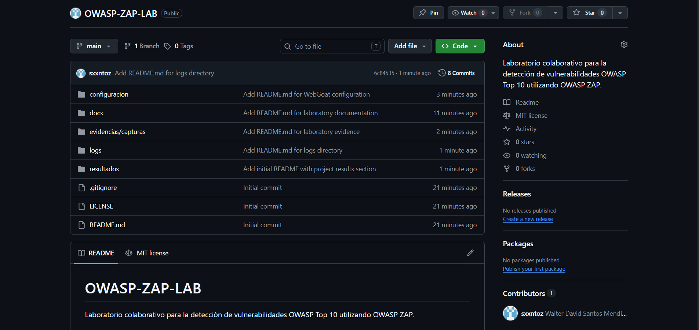

---

# Paso 3. Verificar requisitos de virtualización

## 3.1 Abrir el Administrador de tareas

1. Presionar:

```text
Ctrl + Shift + Esc
```

2. Ir a la pestaña:

```text
Rendimiento
```

3. Seleccionar:

```text
CPU
```

4. Verificar que aparezca:

```text
Virtualización: Habilitado
```

### Evidencia

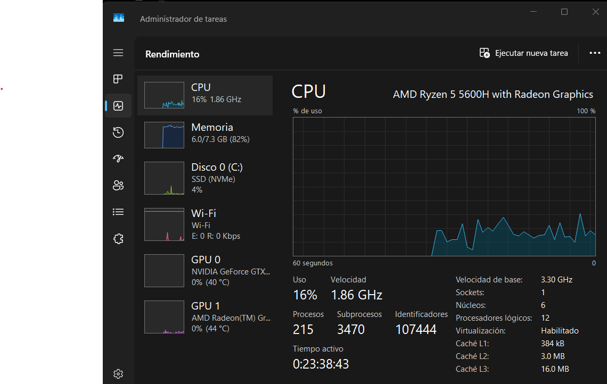

---

# Paso 4. Instalar Docker Desktop

## 4.1 Descargar Docker Desktop

1. Acceder a:

https://www.docker.com/products/docker-desktop/

2. Descargar la versión:

```text
Windows AMD64
```

---

## 4.2 Ejecutar el instalador

1. Ejecutar el archivo descargado.
2. Seleccionar:

```text
All-users installation
```

3. Continuar con la instalación.

### Evidencia

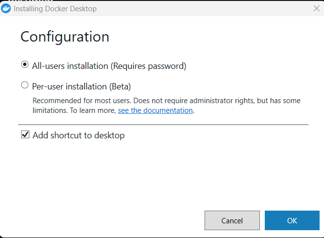

---

## 4.3 Reiniciar el sistema

1. Finalizar la instalación.
2. Reiniciar Windows cuando sea solicitado.

### Evidencia

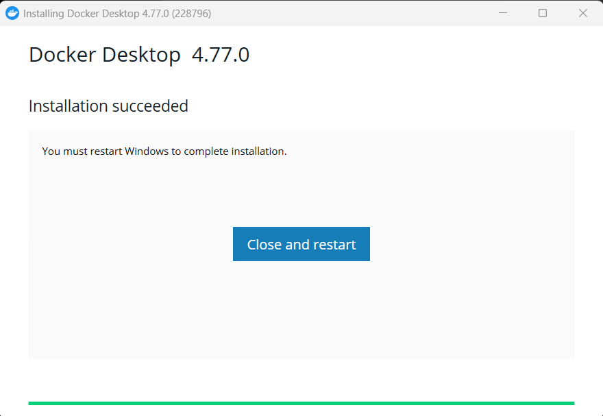

---

## 4.4 Instalar WSL2

Docker Desktop requiere WSL2 para ejecutar contenedores Linux.

### Abrir CMD como Administrador

Presionar:

```text
Inicio → CMD → Ejecutar como administrador
```

### Instalar WSL

Ejecutar:

```bash
wsl --install
```

Este comando:

* Instala Windows Subsystem for Linux.
* Descarga Ubuntu.
* Configura WSL2.
* Prepara el sistema para Docker Desktop.

### Evidencia

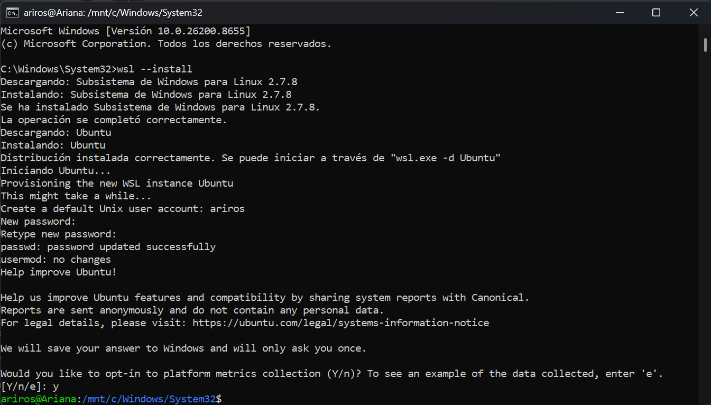

---

### Reiniciar el equipo

Una vez finalizada la instalación reiniciar Windows.

### Verificar la instalación de WSL

Ejecutar:

```bash
wsl --version
```

Resultado esperado:

```text
WSL version: X.X.X
Kernel version: X.X.X
```

### Evidencia

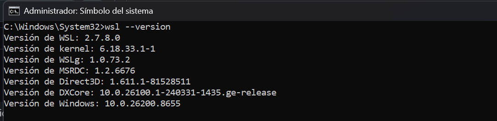

---

## 4.5 Configurar Ubuntu

Después del reinicio Ubuntu iniciará automáticamente.

### Crear usuario Linux

Ejemplo:

```text
Usuario: david
```

### Crear contraseña

Ingresar una contraseña y confirmarla.

### Finalizar configuración

Esperar hasta visualizar el prompt del sistema Ubuntu.

---

## 4.6 Verificar Docker Desktop

Abrir CMD.

### Verificar versión de Docker

Ejecutar:

```bash
docker --version
```

Resultado esperado:

```text
Docker version 29.5.3
```

### Verificar que Docker esté funcionando

Ejecutar:

```bash
docker ps
```

Resultado esperado:

```text
CONTAINER ID   IMAGE   COMMAND   CREATED   STATUS   PORTS   NAMES
```

Si aparece la tabla anterior significa que Docker Engine está funcionando correctamente.

### Evidencia

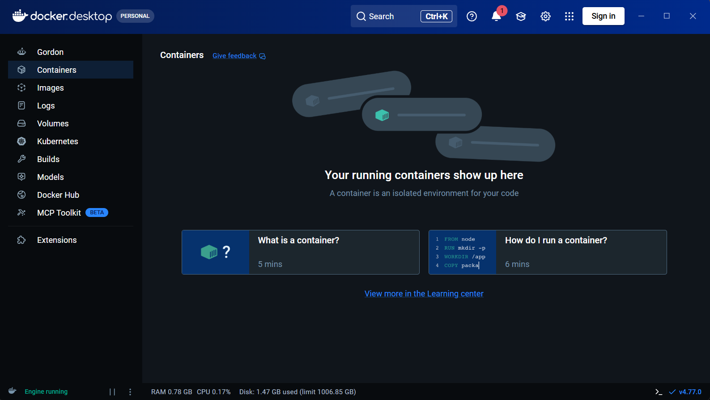

---

# Paso 5. Implementar DVWA

## 5.1 Descargar la imagen Docker

Abrir CMD y ejecutar:

```bash
docker pull vulnerables/web-dvwa
```

### Evidencia

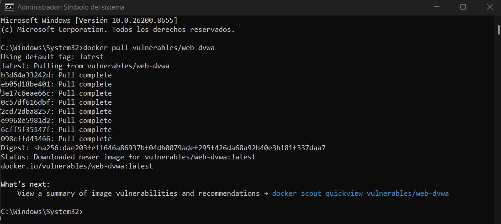

---

## 5.2 Crear el contenedor

Ejecutar:

```bash
docker run -d --name dvwa -p 8080:80 vulnerables/web-dvwa
```

### Evidencia

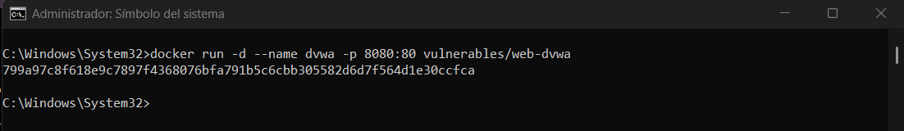

---

## 5.3 Verificar el contenedor

Ejecutar:

```bash
docker ps
```

Debe aparecer:

```text
dvwa
```

### Evidencia

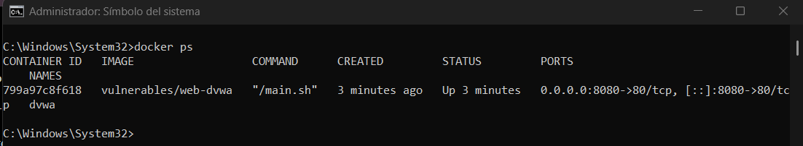

---

## 5.4 Verificar funcionamiento

Abrir el navegador:

```text
http://localhost:8080
```

### Evidencia

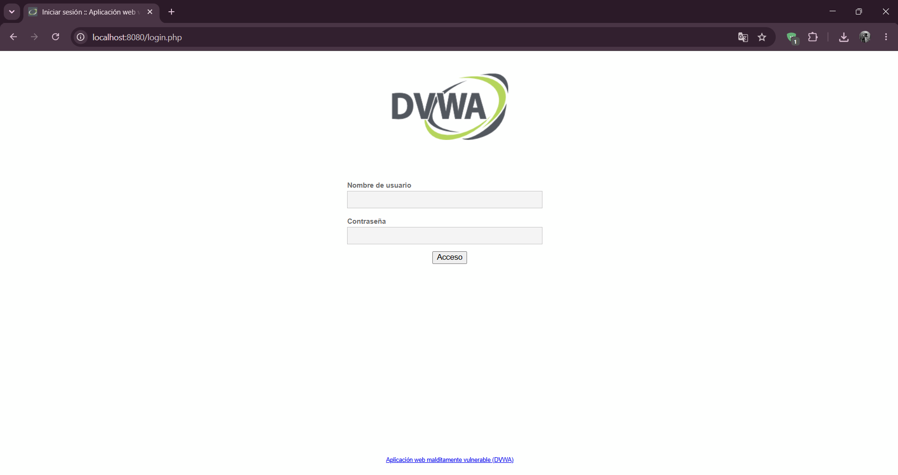

---

# Paso 6. Implementar OWASP Juice Shop

## 6.1 Descargar la imagen Docker

Ejecutar:

```bash
docker pull bkimminich/juice-shop
```

### Evidencia

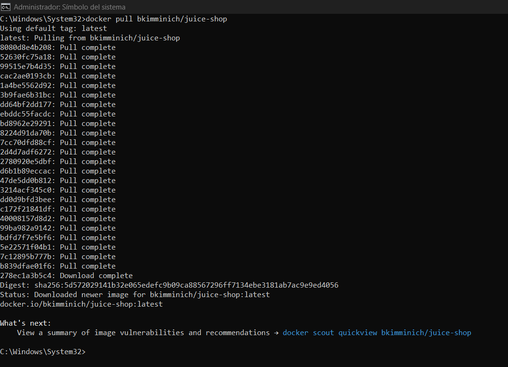

---

## 6.2 Crear el contenedor

Ejecutar:

```bash
docker run -d --name juice-shop -p 3000:3000 bkimminich/juice-shop
```

### Evidencia

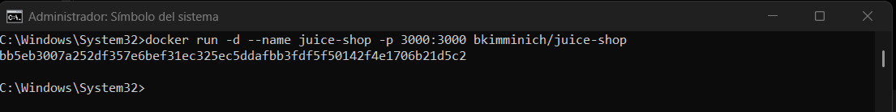

---

## 6.3 Verificar el contenedor

Ejecutar:

```bash
docker ps
```

Debe aparecer:

```text
juice-shop
```

### Evidencia

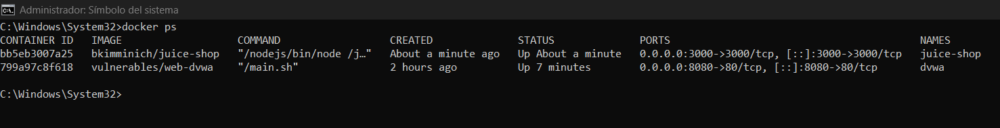

---

## 6.4 Verificar funcionamiento

Abrir:

```text
http://localhost:3000
```

### Evidencia

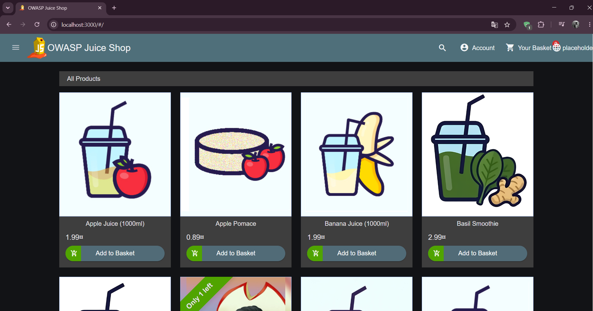

---

# Paso 7. Implementar WebGoat

## 7.1 Descargar la imagen Docker

Ejecutar:

```bash
docker pull webgoat/webgoat
```

### Evidencia

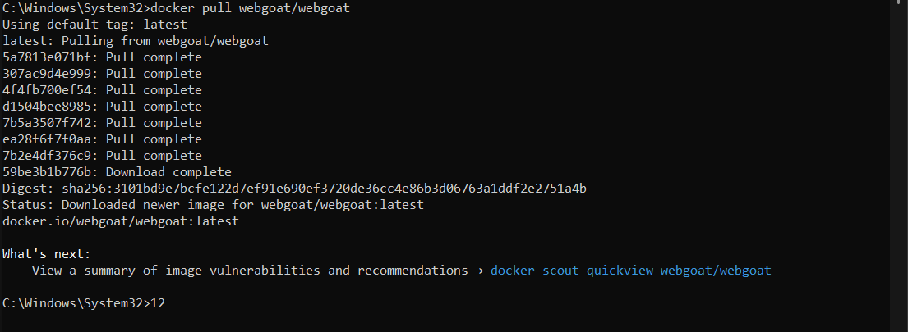

---

## 7.2 Crear el contenedor

Ejecutar:

```bash
docker run -d --name webgoat -p 8081:8080 webgoat/webgoat
```

### Evidencia

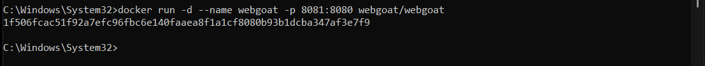

---

## 7.3 Verificar el contenedor

Ejecutar:

```bash
docker ps
```

Debe aparecer:

```text
webgoat
```

### Evidencia

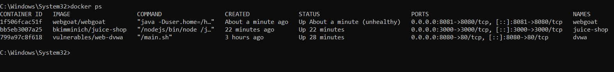

---

## 7.4 Verificar funcionamiento

Abrir:

```text
http://localhost:8081/WebGoat
```

### Evidencia

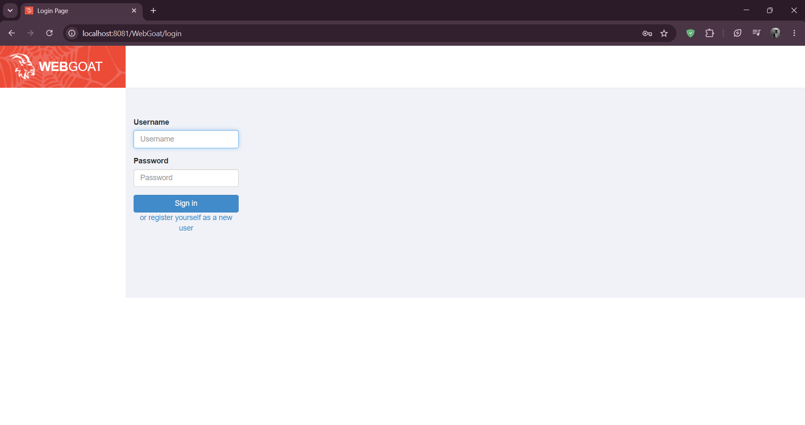

---

# Paso 8. Instalar OWASP ZAP

## 8.1 Ejecutar el instalador

1. Descargar OWASP ZAP desde el sitio oficial.
2. Ejecutar el instalador en Windows.

### Evidencia

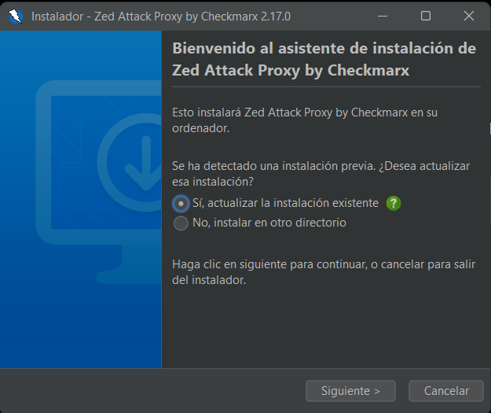

---

## 8.2 Instalar OWASP ZAP

1. Aceptar los términos de licencia.
2. Continuar con la instalación utilizando la configuración predeterminada.
3. Esperar a que finalice el proceso.

### Evidencia

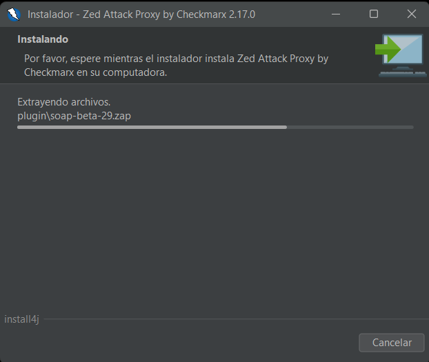

---

## 8.3 Finalizar la instalación

1. Una vez concluida la instalación seleccionar **Finish**.
2. Esperar a que la aplicación se inicie automáticamente.

### Evidencia

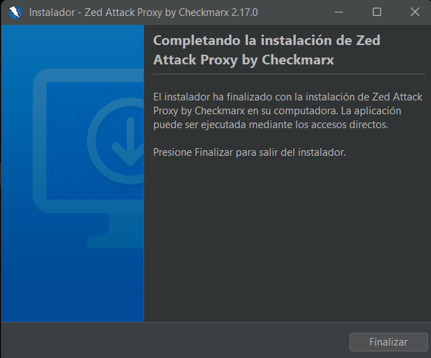

---

## 8.4 Abrir OWASP ZAP

1. Iniciar OWASP ZAP.
2. Aceptar la configuración predeterminada de la sesión.
3. Verificar que aparezca la interfaz principal de la herramienta.

### Evidencia

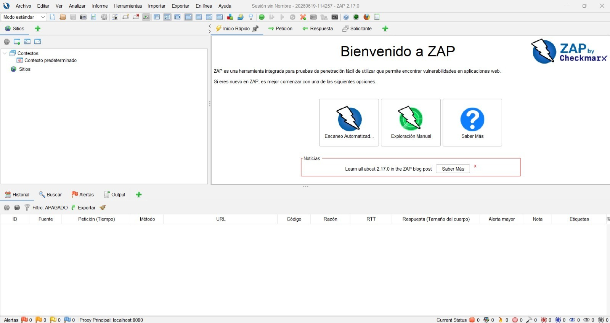

---

# Paso 9. Descubrimiento de recursos mediante Spider

La herramienta **Spider** permite recorrer automáticamente una aplicación web para descubrir enlaces, páginas, directorios y recursos disponibles. Esta información servirá como base para los análisis de seguridad posteriores.

---

## 9.1 Ejecutar Spider sobre DVWA

1. Seleccionar el sitio DVWA dentro de OWASP ZAP.
2. Ir a **Attack → Spider**.
3. Ejecutar el rastreo completo de la aplicación.
4. Esperar hasta que finalice el proceso.

### Evidencia


---

## 9.2 Ejecutar Spider sobre OWASP Juice Shop

1. Seleccionar el sitio OWASP Juice Shop.
2. Ejecutar la herramienta **Spider**.
3. Esperar a que termine el descubrimiento automático de recursos.

### Evidencia

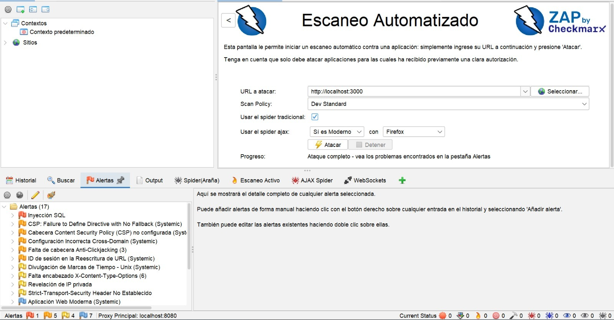

---

## 9.3 Ejecutar Spider sobre WebGoat

1. Seleccionar el sitio WebGoat.
2. Ejecutar la herramienta **Spider**.
3. Verificar que OWASP ZAP descubra las rutas disponibles de la aplicación.

### Evidencia

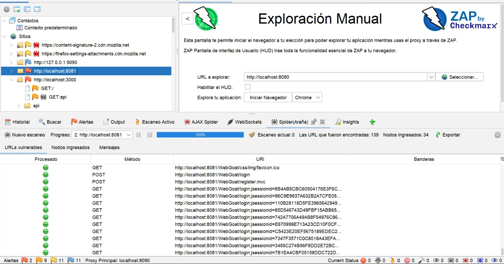

---

# Paso 10. Descubrimiento de contenido dinámico mediante AJAX Spider

Las aplicaciones modernas utilizan JavaScript para cargar contenido dinámicamente. La herramienta **AJAX Spider** permite identificar estos recursos simulando la navegación de un usuario dentro de la aplicación.

---

## 10.1 Ejecutar AJAX Spider sobre DVWA

1. Seleccionar el sitio DVWA.
2. Ir a **Attack → AJAX Spider**.
3. Esperar a que finalice el análisis.

### Evidencia

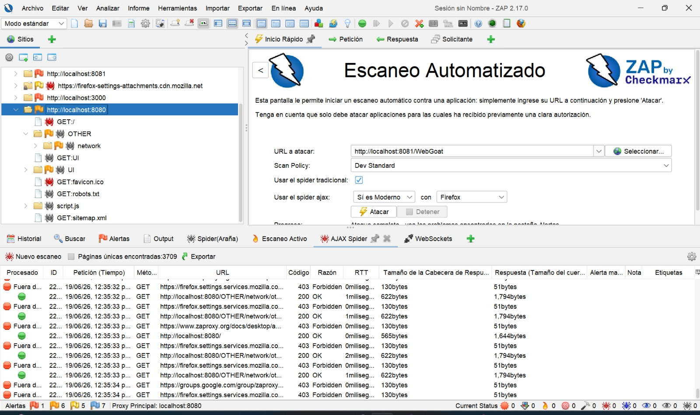

---

## 10.2 Ejecutar AJAX Spider sobre OWASP Juice Shop

1. Seleccionar el sitio OWASP Juice Shop.
2. Ejecutar **AJAX Spider**.
3. Esperar hasta que concluya el proceso.

### Evidencia

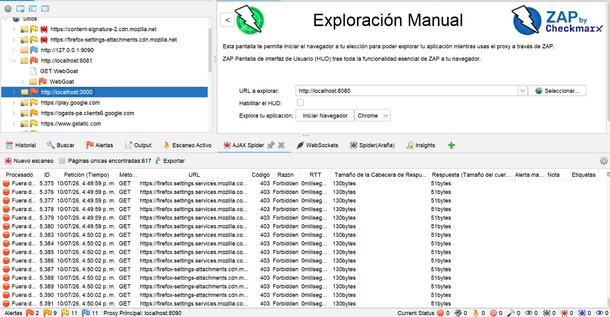

---

## 10.3 Ejecutar AJAX Spider sobre WebGoat

1. Seleccionar el sitio WebGoat.
2. Ejecutar **AJAX Spider**.
3. Esperar a que finalice el rastreo dinámico.

### Evidencia

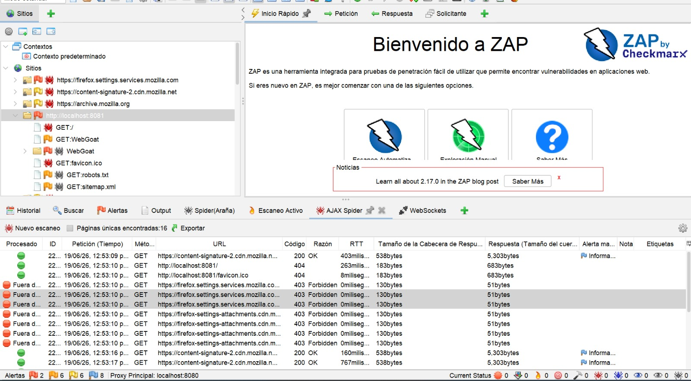

---

# Paso 11. Revisar las alertas pasivas

Durante el reconocimiento, OWASP ZAP realiza automáticamente un análisis pasivo de las respuestas del servidor, detectando posibles problemas de configuración sin alterar el funcionamiento de las aplicaciones.

## 11.1 Visualizar las Passive Alerts

1. Abrir el panel **Alerts**.
2. Revisar las alertas clasificadas por nivel de riesgo.
3. Verificar que se hayan generado hallazgos iniciales para las aplicaciones analizadas.

### Evidencia

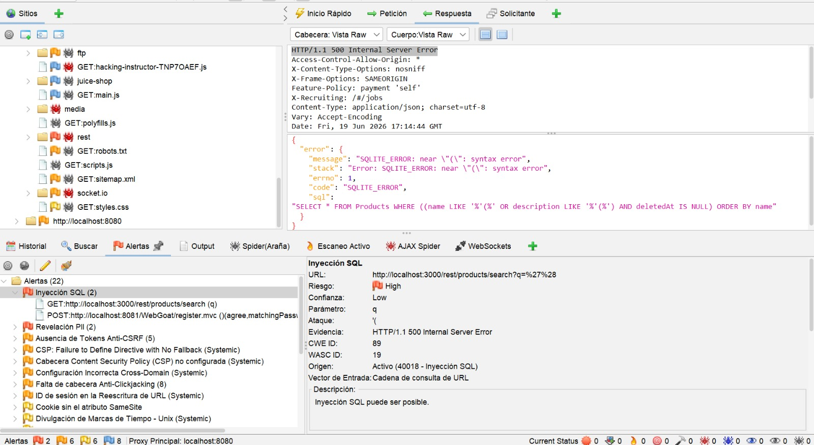

---

# Entregables para la Persona 2

Al finalizar esta fase deberán encontrarse disponibles:

* OWASP ZAP instalado correctamente.
* Las aplicaciones DVWA, OWASP Juice Shop y WebGoat registradas en OWASP ZAP.
* Reconocimiento mediante **Spider** realizado.
* Reconocimiento mediante **AJAX Spider** realizado.
* Alertas pasivas generadas correctamente.
* Evidencias documentadas de cada actividad desarrollada.

La Persona 3 utilizará la información recopilada durante esta fase para ejecutar los análisis activos (Active Scan) y evaluar las vulnerabilidades correspondientes al OWASP Top 10.


